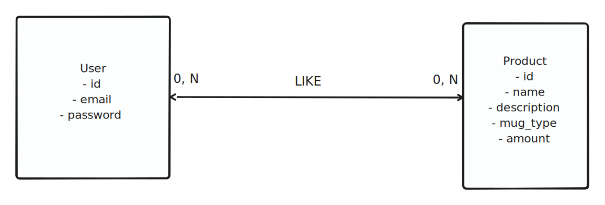
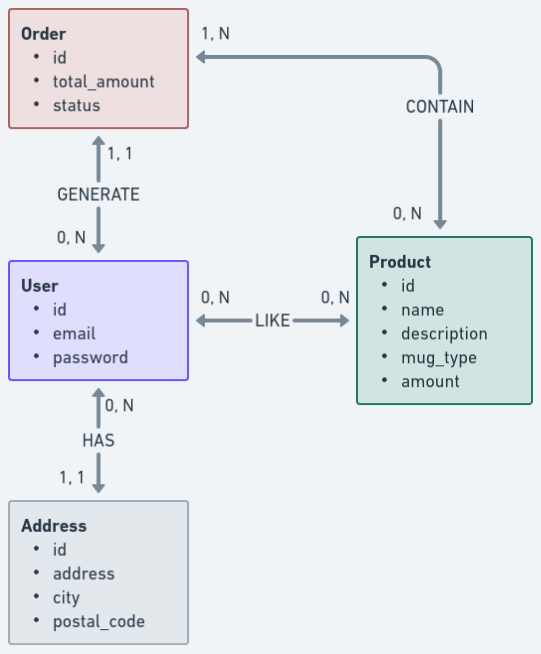

# MCD - Correction

## Problèmes rencontrés

Bravo pour ton travail, maintenant, mon avis ! :grin:
Tout d'abord, ce qui me saute aux yeux!  :worried:

### La relation User-Product

Dans ton énoncé, tu nous dis qu'un utilisateur peut liker un ou plusieurs mug. Il peut aussi ne pas en liker du tout ! 
Un mug peut être liké par 0 utilisateur ou alors plein d'utilisateurs.

Les cardinalités sont donc fausses.
En effet, ce serait plutôt :
Relation entre User et Product (tldraw)

A noter que tu as précisé que c'était Many To Many, et donc du coup, ce sera forcément du `0 ou 1, N` face à du `0 ou 1, N`
[Un petit coup sur la doc !](https://sqlpro.developpez.com/cours/modelisation/merise/?page=passage)

### Pour le reste : Rien à dire c'est OK !
Les verbes sont plutôt bien choisis, on va pas faire la fine bouche !
Les autres cardinalités sont en rapport avec le contexte.
Les relations sont bien définies.

Voici une correction proposée réalisée avec Whimsical

### D'autres outils possibles

Pour réaliser tes outils, c'est une question de goût, dans cette correction j'ai utilisé [Whimsical](https://whimsical.com/) et [tldraw](https://www.tldraw.com/).
Note bien que Whimsical et tldraw permetttent aussi la conception de wireframes, cela peut être utile pour plus tard !

Il existe aussi beaucoup d'autres notamment un qui permet aussi de créer un fichier .sql pour générer ta base de données. Génial non? :smile:
Il s'agit de [MoCoDo](https://www.mocodo.net/), un peu difficile à prendre en main mais un régal une fois qu'on a compris la syntaxe! 

D'autres noms :
[Diagrams](https://app.diagrams.net/)
[Looping](https://www.looping-mcd.fr/)

A toi de voir lequel tu préfères!

En tout cas bravo pour cette réalisation